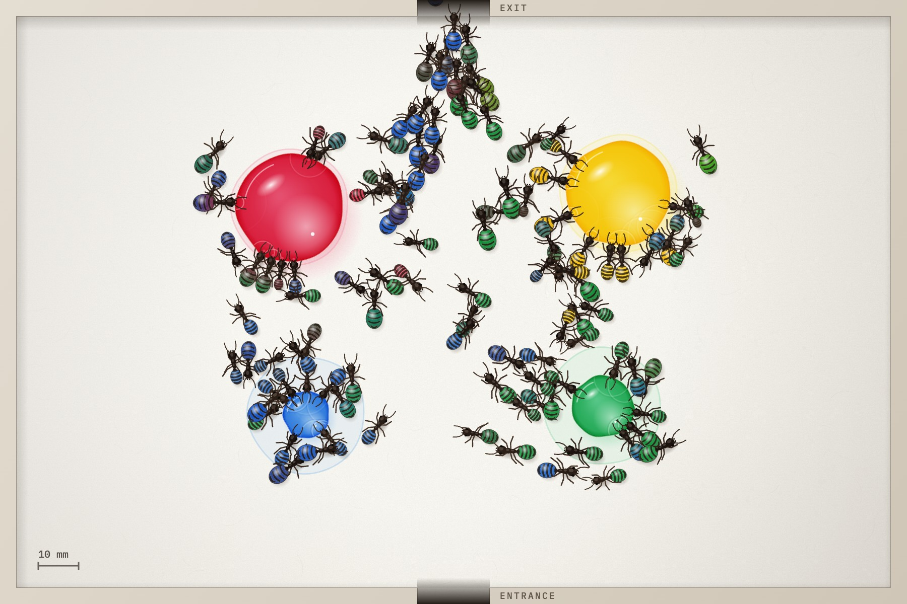

# Rainbow Ants

Ants have see-through abdomens, so whatever they drink shows. Rainbow Ants is a browser simulation of the coloured sugar water experiment. Put out drops of dyed sugar water, let the ants in, and watch them fill up with colour.



## Running it

Open `index.html` in a browser. It's plain HTML, CSS and JavaScript, with no build step and no dependencies. The fonts load from Google Fonts; offline, it falls back to system fonts.

To serve it locally instead, run this in the project folder and open <http://localhost:8765>:

```bash
python3 -m http.server 8765
```

## Controls

| Control | What it does |
| --- | --- |
| **Drops** | Red, yellow, blue and green, with red only by default. Drag a drop to move it before a run. |
| **Ants** | 1 to 200, default 25. They come in through the door at the bottom. Drops get bigger as you add ants, so there's enough for all of them. |
| **Fullness** | How much each ant drinks before it leaves through the door at the top. |
| **Drop hopping** | The chance an ant moves on to another drop part-way through, which mixes the colours. |
| **Speed** | ½× to 4×. |

Press **Go** (or Space) to start, pause and resume. Each ant that leaves is added to the tally in the colour it ended up.

## How it works

- **Ants** head for the nearest drop first. An ant that moves on part-way through picks another drop at random. When a drop is crowded, ants wait their turn and circle it looking for a gap.
- **Abdomens** swell as the ants drink. The hard plates on an ant's back don't stretch, so they spread apart and the coloured liquid shows between them.
- **Colours** mix the way food dye does. Each dye's absorbance is worked out from its colour and combined using the Beer–Lambert law, so yellow and blue make green, red and blue make purple, and a fuller abdomen shows a deeper colour. Fresh liquid shows near the waist first and blends back towards the tip.
- **Drops** shrink and get paler as they're drunk, leaving a stain where they started. Between them they hold 20% more than all the ants can drink.
- **Drawing** is all on a 900×600 canvas, rendered at full resolution on high-density screens.

[`ants.js`](ants.js) holds the simulation and drawing, and [`index.html`](index.html) holds the page and controls. For tinkering, `window.rainbowAnts` in the browser console exposes the simulation state along with `step(dt)` and `render()`.

## Inspiration

Photographs and video of ants drinking coloured sugar water, from the [Smithsonian](https://www.smithsonianmag.com/science-nature/these-rainbow-colored-transparent-ants-are-what-they-eat-25521112/) and [Imgur](https://imgur.com/ants-drinking-different-colored-sugar-water-8pA4wAa).
